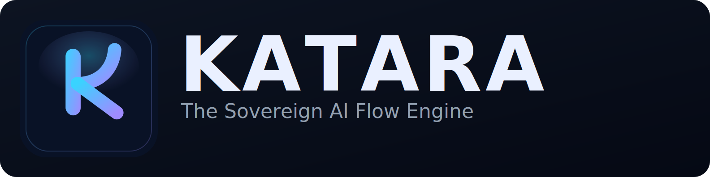

# KATARA



> **The Sovereign AI Flow Engine** — compile the smallest useful context before every LLM call.

[](https://github.com/katara-project/katara/actions/workflows/ci.yml)
[](LICENSE)
[](VERSION)

## What makes KATARA different

Most AI gateways route requests. KATARA goes further:

| Feature | Description |
| --- | --- |
| **Context Budget Compiler** | Reduces raw prompts, logs, diffs, and transcripts before model invocation |
| **Context Memory Lensing** | Reuses stable context blocks and sends only deltas when possible |
| **AI Flow Visualizer** | Makes every optimization step visible in a live dark dashboard |
| **Hybrid Sovereign Routing** | Routes intelligently across local, private, and cloud LLMs |
| **AI Efficiency Score** | Quantifies token savings, cost reduction, and context reuse |

## Architecture

```text
Clients / IDE / Agents
        │
  OpenAI-compatible API
        │
      KATARA
        │
  ┌─────┴─────┐
  │  Intent   │
  │  Detector │
  └─────┬─────┘
        │
  ┌─────┴──────────┐
  │ Context Budget │
  │ Compiler       │
  └─────┬──────────┘
        │
  ┌─────┴──────────┐
  │ Context Memory │
  │ Lensing        │
  └─────┬──────────┘
        │
  ┌─────┴──────────┐
  │ Semantic Cache │
  └─────┬──────────┘
        │
  ┌─────┴──────────┐
  │ Hybrid Router  │
  └─────┬──────────┘
        │
  Local / Private / Cloud Providers
```

## Live data flow

```text
┌─────────────────────┐         POST /v1/compile            ┌──────────────────────────┐
│   Client (curl,     │ ──────────────────────────────────► │   KATARA Rust Backend    │
│   VS Code ext,      │                                     │                          │
│   any AI tool)      │ ◄────── JSON response ───────────── │  compile() → fingerprint │
└─────────────────────┘                                     │   → cache → compiler     │
                                                            │   → memory → router      │
┌─────────────────────┐                                     │                          │
│   Vue Dashboard     │ ◄── SSE /v1/metrics/stream ──────── │  MetricsCollector (Arc)  │
│   (Pinia store)     │     text/event-stream               │   - cumulative totals    │
│                     │     { raw, compiled, reused, ... }  │   - 24-point history     │
│   EventSource API   │     every 2 seconds                 │   - per-provider counts  │
└─────────────────────┘                                     └──────────────────────────┘
```

Every `POST /v1/compile` runs the full pipeline (fingerprint → cache → compiler → memory → router → metrics) and feeds a shared `MetricsCollector`. The Vue dashboard auto-connects via SSE and updates in real time — no polling, no WebSocket.

## Monorepo layout

| Directory | Purpose |
| --- | --- |
| `core/` | Gateway bootstrap and API entry point |
| `compiler/` | Context Budget Compiler and reducers |
| `memory/` | Context Memory Lensing and delta engine |
| `router/` | Provider selection and routing strategies |
| `adapters/` | Provider-specific HTTP clients |
| `metrics/` | Efficiency scoring and telemetry |
| `cache/` | Semantic cache scaffolding |
| `fingerprint/` | Prompt fingerprint graph |
| `dashboard/ui-vue/` | Vue 3 + Vite dark dashboard |
| `configs/` | Provider, routing, and policy configuration |
| `deployments/` | Docker, Kubernetes, and Helm manifests |
| `docs/` | Architecture and implementation notes |
| `examples/` | Quick integration examples |
| `mcp/` | MCP server for VS Code Copilot integration |
| `benchmarks/` | Reproducible token-reduction fixtures |

## Quick start

### Windows

```powershell
# 1. First-time setup (installs Rust, Node.js, builds crates, installs npm deps)
.\scripts\bootstrap-win.ps1

# 2. Start all services (Ollama + backend + dashboard)
.\scripts\start-win.ps1
```

### Linux / macOS

```bash
# First-time setup
./scripts/bootstrap.sh

# Start backend manually
cargo run -p core
```

### Manual

```bash
# Rust backend
cargo run -p core

# Vue dashboard (separate terminal)
cd dashboard/ui-vue && npm install && npm run dev

# MCP server (managed automatically by VS Code via mcp.json)
# If testing manually: cd mcp && node katara-server.mjs
```

### Secrets management

API keys are stored in a `.env` file at the project root.
This file is **excluded from Git** (listed in `.gitignore`).

```bash
cp .env.example .env
# Edit .env with your real keys
```

See `.env.example` for the expected variables.

## VS Code Agent Integration

KATARA ships with a built-in MCP (Model Context Protocol) server.
Once configured, type `@katara` in VS Code Copilot Chat to invoke KATARA tools directly.

```text
Copilot Chat  →  @katara  →  MCP stdio  →  katara-server.mjs  →  localhost:8080
```

| Tool | Description |
| --- | --- |
| `katara_compile` | Compile raw context through the full pipeline |
| `katara_chat` | Compile + forward to routed LLM |
| `katara_set_client_context` | Update the live upstream client model/provider context |
| `katara_providers` | List configured providers |
| `katara_metrics` | Fetch live metrics snapshot |

The chat endpoint also supports `stream=true` and proxies OpenAI-compatible SSE responses from the routed provider.
It preserves full message history (`system`, `assistant`, `user`) and forwards extra OpenAI-compatible request options like `temperature` to the routed provider.
The semantic cache now stores the full compiler result, so repeated prompts can reuse the same `compiled_context` without recompiling before routing.

The MCP server uses `@modelcontextprotocol/sdk` v1.27.1 with stdio transport.
Dependencies are installed in `mcp/node_modules/` — run `npm install` inside `mcp/` if pulling fresh.

The MCP layer now forwards client lineage metadata automatically to KATARA:

- `client_app`: defaults to `VS Code Copilot Chat`
- `upstream_model`: resolved per request from the tool's `model`, MCP `_meta`, or an optional runtime resolver command
- `upstream_provider`: resolved per request from MCP `_meta`, a runtime resolver command, or inferred from the upstream model family

This is what lets the dashboard distinguish the user-facing assistant/client model from the model actually routed by KATARA.

KATARA now also performs a best-effort scan of MCP request metadata for generic model/provider fields when clients expose them without the custom `katara/*` keys. This improves automatic detection of Copilot-selected models such as `GPT-5.4` when that information is actually present.

The Overview now also exposes a live `Last Request` panel showing:

- upstream client app, provider, and model
- routed provider and routed model
- cache hit vs miss
- sensitive override vs standard routing

The Overview also has a dedicated `Upstream Client Models` table so a model such as `GPT-5.4` selected in VS Code Copilot is visible separately from the routed model efficiency table.
When the client does not expose its selected model, the Overview now shows a prominent warning banner instead of silently implying that the upstream model is known.

The dashboard also includes a `Runtime Audit` view backed by the rolling `request_history` snapshot so operators can inspect the latest routed requests without opening raw JSON metrics.

When the upstream client cannot send its selected model directly, update the live context with:

```powershell
.\scripts\set-upstream-context.ps1 -UpstreamProvider Anthropic -UpstreamModel "Claude Sonnet 4.6"
```

or through the MCP tool `katara_set_client_context`.

See [INSTALL.md](INSTALL.md#vs-code-agent-mcp) for setup instructions and [TESTING.md](TESTING.md#mcp-agent-tests-vs-code) for validation steps.

## Workflow Schema (MCP -> Katara Agent -> Katara App)

```text
┌──────────────────────────────┐
│ VS Code Copilot Chat         │
│ (user prompt: @katara ...)   │
└──────────────┬───────────────┘
               │
               │ MCP stdio (JSON-RPC 2.0)
               ▼
┌──────────────────────────────┐
│ Katara MCP Server            │
│ mcp/katara-server.mjs        │
│ - katara_compile             │
│ - katara_chat                │
│ - katara_metrics             │
│ - katara_providers           │
└──────────────┬───────────────┘
               │
               │ HTTP (localhost:8080)
               ▼
┌──────────────────────────────┐
│ Katara App (Rust backend)    │
│ core + compiler + memory     │
│ cache + router + metrics     │
│ /v1/compile                  │
│ /v1/chat/completions         │
│ /v1/metrics                  │
│ /v1/providers                │
└──────────────┬───────────────┘
               │
               │ Routed request (policy + intent)
               ▼
┌──────────────────────────────┐
│ LLM Providers                │
│ local / private / cloud      │
└──────────────────────────────┘
```

## Version

Current runtime version is served from the root [VERSION](VERSION) file and exposed live via `GET /version`.

See [CHANGELOG.md](CHANGELOG.md) for release history and [ROADMAP.md](ROADMAP.md) for planned iterations.

## Testing

See [TESTING.md](TESTING.md) for the complete verification guide:
curl smoke tests, intent routing matrix, MCP agent tests, and a PowerShell quick-test script.

## Status

This is a **V7.7.1 runtime**: coherent, GitHub-ready, and implementation-oriented.
Live benchmarks, MCP agent integration, and per-intent metrics are operational.
Provider adapters (`/v1/chat/completions`) forward to real Ollama and Mistral cloud endpoints.
It is not yet a fully production-complete gateway across every provider.

## License

[AGPL-3.0 + Commons Clause](LICENSE) — Copyright 2024–2026 Christophe Freijanes and KATARA contributors.

Free for personal, educational, and non-commercial use. Commercial redistribution or resale requires explicit written authorization from the original author.
